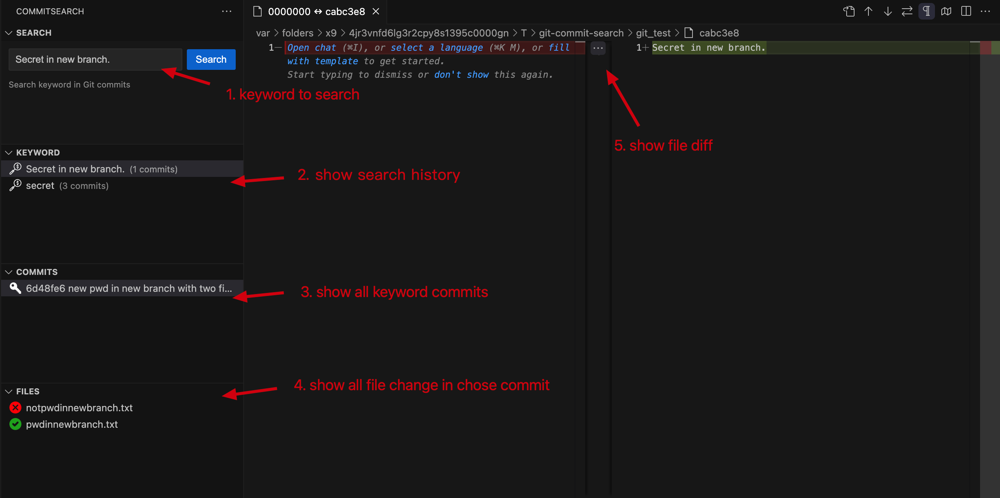
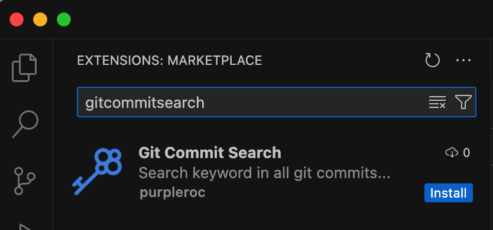

# GitCommitSearchExt
Vscode extension for search keyword in all commit...

## Usage

## Install
1. Search `gitcommitsearch` in vscode extension market and install.

2. Open Url with browser
[Click me](https://marketplace.visualstudio.com/items?itemName=purpleroc.gitcommitsearch)

3. Download `gitcommitsearch-1.2.0.vsix` and install from local